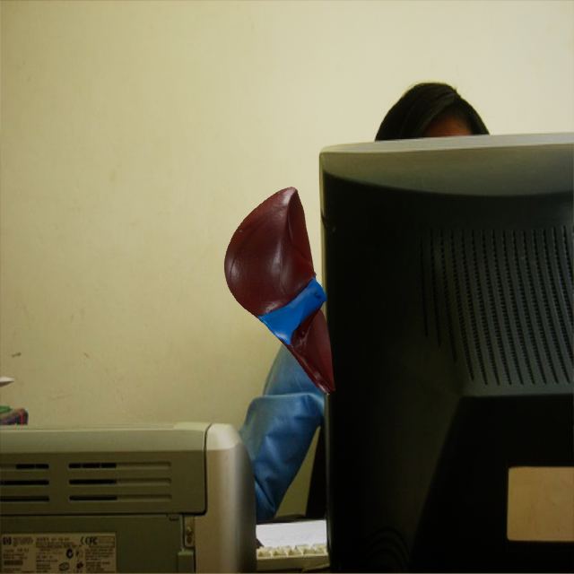
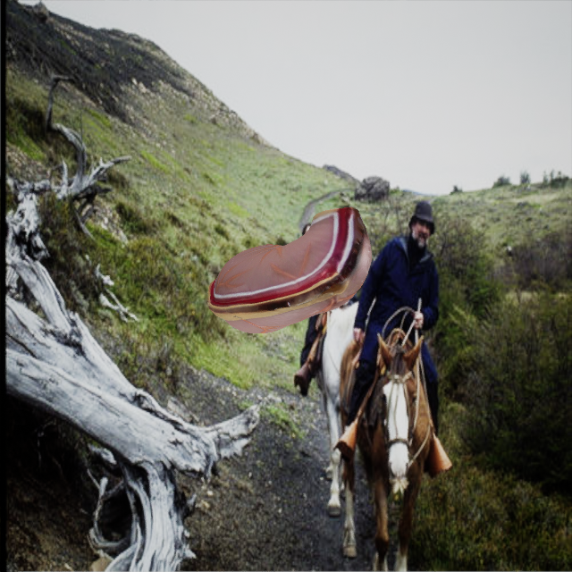
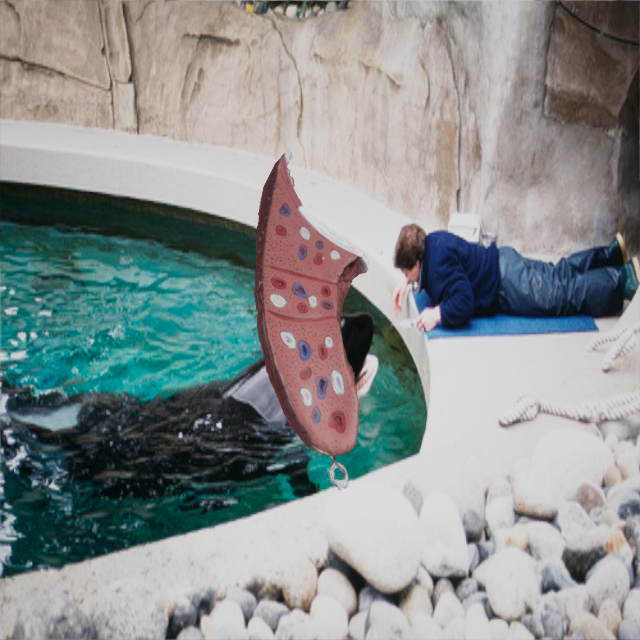

# 6DoF Organ Tracking Demo

## Description
This project showcases 6DoF tracking using DOPE architecture. 

---

## Image Dataset:

Here are some examples of images generated that were generated using 3D textured models and NDDS.

  
  
  

### Tracking Demo
Below is a demo of the tracking for all organs.

https://github.com/user-attachments/assets/0d3e6188-7794-4b1a-89c9-5e7e1cbf6d6d

---

